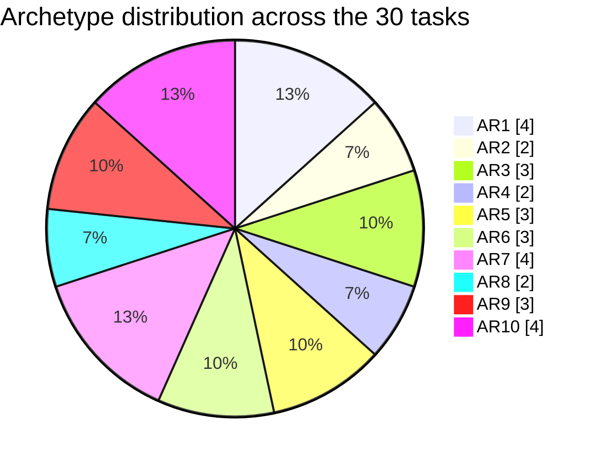
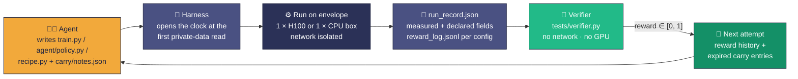
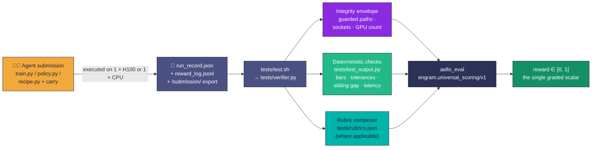

<div align="center">


# AELLO · Frontier Agentic ML Task Suite

**🧠 Train. &nbsp;⚙️ Tune. &nbsp;🔧 Serve. &nbsp;📊 Score.**

> **Frontier-difficulty agentic ML task suite · 30 Harbor delivery units · one H100 or one 8-core CPU per attempt ·
> up to 50 refinement attempts · universal engram scoring, single scalar reward in `[0, 1]`**

[Motivation](#-motivation--intended-use)&nbsp; · &nbsp;[Anatomy](#-anatomy-of-an-aello-task)&nbsp; · &nbsp;[Reward](#-reward-design)&nbsp; · &nbsp;[Grading](#-how-grading-works)&nbsp; · &nbsp;[Delivery](#-whats-in-this-delivery)&nbsp; · &nbsp;[Promotion](#-promotion--forge-invariant)


*Thirty distinct research problems, one uniform scoring contract, and a hard compute clock —
**the only way to be fast is to already know**.*

</div>

Sample delivery of the **AELLO** task suite: **30 [Harbor-format](https://harborlabs.dev) delivery units**, each a single frontier-difficulty agentic-ML slot with a private held-out grading path, a fixed compute envelope (one NVIDIA H100 80GB or an 8-core CPU box), up to **50 refinement attempts per task**, and a single scalar reward on `[0, 1]` written through the universal engram scoring contract.

Every unit ships with a Dockerfile per side (`environment/Dockerfile` for the agent sandbox, `tests/Dockerfile` for the network-isolated verifier), a full oracle reference (`solution/reference.py`), a judge-facing ground-truth narrative (`solution/TRUTH.md`), the frozen scoring config (`tests/constants.json`, `tests/rubrics.json`), and the entry-point verifier (`tests/verifier.py` driven by `tests/test.sh`).

This drop is the **task-authoring sample**: bundles are shipped structurally complete, but per-task measurement anchors (bars, ramps, ceilings) are populated by the grading host's measurement wave and may be null in this build. Promotion of any bundle from `dataset/` to top-level is governed by the FORGE invariant described in [Promotion](#-promotion--forge-invariant); the honest state of that promotion index is preserved.

## TL;DR

- **What it is.** Thirty *distinct* agentic ML research slots — from decoder-only architecture design on PG-19, to multispectral BigEarthNet classifiers under a 4 MiB parameter ceiling, to WebArena scaffolds against a private held-out split, to CUDA-kernel micro-benchmarks under a numerical-fidelity envelope — packaged as **Harbor delivery units** under one uniform reward contract. Not a single environment repeated with parameters; thirty separate research problems.
- **How it grades.** Each task ships a network-isolated verifier (`tests/verifier.py`) that consumes an agent submission, applies deterministic checks against a per-task `tests/constants.json` (bars, tolerances, red lines, ramp anchors), and emits a single reward in `[0, 1]` via `aello_eval`. Rubrics live in `tests/rubrics.json`; the shared scoring package is `engram.universal_scoring/v1`.
- **Why it discriminates.** Every task pairs a **published gate** (bars, tolerances, latency ceilings, sibling-gap constraints) with a **private held-out shard** the agent never sees. Red lines zero the score *before* any speed or accuracy is considered. The design assumes iterated attempts — the reward history and per-attempt carry stores are load-bearing, so a policy that treats every attempt as independent forfeits the compounding gain.
- **What ships now.** 30 UUID-named task directories (`task.toml` + `instruction.md` + `environment/` + `solution/` + `tests/`). Scored model trajectories are **not** part of this sample delivery.

## ✨ At a glance

| Field | Value |
| --- | --- |
| Task suite | **AELLO**, thirty frontier-difficulty agentic ML slots under one universal reward |
| Format | [Harbor](https://harborlabs.dev) delivery units, `schema_version = "1.4"` |
| Tasks | 30 |
| Compute envelope | Per attempt: 1 × NVIDIA H100 80GB (24 tasks) or 8-core CPU + 64 GiB RAM (3 tasks); verifier grades CPU-only for every slot |
| Per-attempt budget | 6.0 h (`budget_hours`), hard-timed at 8.0 h (`max_timeout`), up to **50 attempts** per task |
| Reward | Single float on `[0, 1]`, higher is better, produced by `aello_eval` |
| Scoring engine | `engram.universal_scoring/v1` |
| Archetypes | AR1 – AR10 (ten canonical task shapes) |
| Categories | C1 pretraining · C2 post-training · C3 data curation · C4 serving/quant · C5 arch-from-scratch · C6 evals/judges · C7 agentic · C8 bounded-continuous |
| Scope split | **15 LLM · 15 non-LLM** |
| Reference solution | `solution/reference.py` + `solve.sh` + `TRUTH.md` for every task |
| Verifier | `tests/test.sh` → `tests/verifier.py`, run in a separate network-isolated container (`environment_mode = "separate"`) |
| Large files | `model.safetensors`, `graph.npz` ignored at the root `.gitignore` |
| License | MIT, © 2026 Ethara.AI |

## Table of contents

- [TL;DR](#tldr)
- [At a glance](#-at-a-glance)
- [Motivation & intended use](#-motivation--intended-use)
- [Anatomy of an AELLO task](#-anatomy-of-an-aello-task)
- [What's in this delivery](#-whats-in-this-delivery)
  - [Sample counts](#sample-counts)
  - [The 30-task matrix](#the-30-task-matrix)
  - [Full task inventory](#full-task-inventory)
- [Repository layout](#-repository-layout)
- [The agent's contract](#-the-agents-contract)
- [Reward design](#-reward-design)
- [How grading works](#-how-grading-works)
- [Quality posture](#-quality-posture)
- [`task.toml` quick reference](#-tasktoml-quick-reference)
- [Running the verifier](#-running-the-verifier)
- [Promotion & FORGE invariant](#-promotion--forge-invariant)
- [Versioning, licensing & citation](#-versioning-licensing--citation)
- [Design notes](#-design-notes)

---

## 🎯 Motivation & intended use

**Why this exists.** Most agentic training tasks reward short bursts of competence: fix a bug, pass a suite, answer a question. AELLO targets the regime that actually separates research policies: **iterated ML work under a hard compute clock, on a task the agent was told nothing about but whose gate is public and whose held-out shard is private**. Over up to 50 attempts, an agent has to allocate attempts between *observing* (measuring the private configuration) and *exploiting* (using what it has measured to hit the gate faster), and the harness carries forward at most a tiny expiring artifact between attempts. Every axis that the standard hyperparameter loop hides — measurement cost, memory decay, red-line integrity, sibling-gap coherence, numerical fidelity envelopes — is explicit and scored.

**Primary intended use.** A reinforcement-learning reward source for training and evaluating long-horizon agentic ML research policies. The consumer rolls out their policy against each task's verifier and uses the scalar reward in `[0, 1]`.

**Also suitable for.**

- **Capability read-outs** on ML research skills that don't appear in short-horizon benchmarks: architecture design, quantization recipes, data curation, retrieval serving under a deadline, agentic tool-use scaffolds, kernel micro-optimization.
- **Ablations** on attempt-budget allocation, carry-store schemas, refresh-vs-exploit splits, and pre-timer-open staging. The `run_record.json` schema each task specifies is built precisely to support these ablations.
- **Curriculum construction** over ten archetypes (AR1–AR10) and eight categories (C1–C8), with LLM and non-LLM halves that can be trained and evaluated independently under one contract.

**Out of scope / not designed for.**

- **A saturated leaderboard.** Several tasks explicitly place the ramp knee *above* the measured reference ceiling (see `solution/TRUTH.md`, e.g. `aello/c8-s1-cifar100-step-budget`), so `r = 1.0` is unreachable by the reference itself and is reserved for submissions that exceed it. Treat any published number as a starting baseline, not a solved benchmark.
- **Real-world deployment.** The world is a seeded, private-shard grading substrate with an explicit red-line contract. Claims should be made about policy quality against that substrate, not about production ML systems.

**Audience.** ML researchers and engineers training long-horizon agentic ML policies, and authors extending the AELLO recipe to new slots.

---

## 🧬 Anatomy of an AELLO task

Each task is a self-contained Harbor delivery unit. The contract a model faces, per task:

1. The agent receives `instruction.md` and a working directory (`workdir = "/workspace"`) with `environment/starter/` (a deliberately unoptimised working program) and any shipped read-only resources.
2. On each attempt the agent writes its deliverable (typically `train.py`, `agent/policy.py`, `recipe.py`, or a checkpoint under `/submission/`) plus an optional expiring **carry store** at `carry/notes.json` (schema and byte-cap fixed per task). The verifier launches a fresh process against a private held-out shard, times the run host-side from the first private-data read to the export write, and records everything into a per-attempt `run_record.json`.
3. The verifier is graded in a **separate container** (`environment_mode = "separate"`) with **no network** and **no GPU** — grading is deterministic and CPU-only. The scalar reward it emits is the graded artifact.

The world is frozen per task through three complementary channels:

- `environment/Dockerfile` builds the agent-side sandbox (CUDA + libraries).
- `tests/Dockerfile` builds the verifier-side sandbox (isolated, no GPU, no network).
- `tests/constants.json` freezes every scalar the reward formula reads (bars, tolerances, ramp anchors, red-line thresholds). Where a constant is populated by the grading host's measurement wave and not yet written, it is deliberately **null** and the bundle is marked *complete but not yet gradeable*.

An **integrity envelope** (see `tests/envelope.py` / `tests/isolation.py` where present) verifies the agent never touched guarded paths, never opened a socket, and never saw more than the declared GPU count.

---

## 📦 What's in this delivery

30 UUID-named task directories at the repository root, each a complete Harbor delivery unit. Every task ships:

| Deliverable | Where it lives |
| --- | --- |
| Agent-facing spec | `<task-uuid>/instruction.md` |
| Agent-side sandbox | `<task-uuid>/environment/Dockerfile` + `environment/starter/` |
| Harbor metadata | `<task-uuid>/task.toml` (`schema_version = "1.4"`) |
| Verifier | `<task-uuid>/tests/` — `test.sh`, `verifier.py`, `test_output.py`, `constants.json`, `rubrics.json`, `Dockerfile` (some tasks also ship `envelope.py`, `isolation.py`, `compose.py`, `aello_eval-*.whl`, `heldout/`) |
| Oracle reference & policy | `<task-uuid>/solution/` — `reference.py`, `solve.sh`, `policy.yaml`, `grounding.yaml`, `recompute.py`, `rubrics.json` |
| Ground truth & provenance | `<task-uuid>/solution/TRUTH.md`, `solution/provenance.yaml`, `solution/provenance_notes.md` |

### Sample counts

<div align="center">

| 🏷️ Scope half | Samples |
| --- | ---: |
| `LLM` (pretraining · post-training · serving · evals · agentic) | **15** |
| `NON_LLM` (image · audio · satellite · tabular · GNN · kernel) | **15** |
| **Total** | **30** |

| 🎚️ Category | What it covers | Samples |
| --- | --- | ---: |
| C1 | Efficient LLM pretraining (wall-clock to a bpb gate) | **2** |
| C2 | LLM post-training on an opaque shard pool | **2** |
| C3 | Data curation & tokenization for a hash-pinned trainer | **3** |
| C4 | Retrieval serving & quantization recipes | **2** |
| C5 (A5-\*) | From-scratch architecture design (LLM decoder · satellite · acoustic) | **3** |
| C6 | Preference judges, step labelers, selective conformal | **3** |
| C7 | Agentic scaffolds (WebArena, telecom) | **2** |
| C8 | Bounded-continuous ML slots (13 varied optimisation problems) | **13** |
| **Total** | | **30** |

| ⚙️ Measurement tier | Samples |
| --- | ---: |
| GPU (one H100 80GB, single-tenant) | **24** |
| CPU (tabular · citation-graph · series substrate) | **3** |
| Tier-flex (deferred to the measurement wave) | **3** |
| **Total** | **30** |

| 🧭 Archetype | Samples |
| --- | ---: |
| AR1 · bounded-continuous, tabular/citation/agentic | **4** |
| AR2 · bounded-continuous, dense-label neural | **2** |
| AR3 · staged pipeline with pinned tools | **3** |
| AR4 · bounded-continuous, low-supervision | **2** |
| AR5 · from-scratch design under multi-budget | **3** |
| AR6 · fixed step / calibration budget | **3** |
| AR7 · data pipeline into a frozen trainer | **4** |
| AR8 · fluency-decoupled judge / mixture manifest | **2** |
| AR9 · wall-clock race to a gate | **3** |
| AR10 · scored-attempt-last with expiring carry | **4** |
| **Total** | **30** |

</div>

### The 30-task matrix

The batch is a deliberate grid over three axes: **scope half** (LLM vs non-LLM), **archetype** (AR1–AR10), and **measurement tier**.

**Category × scope-half** (cell = task count):

| Category | LLM | non-LLM | **Total** |
| --- | ---: | ---: | ---: |
| C1 (pretraining) | 2 | 0 | **2** |
| C2 (post-training) | 2 | 0 | **2** |
| C3 (data curation) | 3 | 0 | **3** |
| C4 (serving/quant) | 2 | 0 | **2** |
| C5 (arch-from-scratch) | 1 | 2 | **3** |
| C6 (evals/judges) | 3 | 0 | **3** |
| C7 (agentic scaffolds) | 2 | 0 | **2** |
| C8 (bounded-continuous) | 0 | 13 | **13** |
| **Total** | **15** | **15** | **30** |



**Uniform envelope** (identical across all 30 tasks):

| Field | Value |
| --- | --- |
| `max_timeout` | 8.0 h |
| `budget_hours` | 6.0 h |
| `max_attempts` | 50 |
| `reward_schema` | one float on `[0, 1]`, higher is better |
| `scoring_engine` | `aello_eval` |
| `universal_scoring_version` | `engram.universal_scoring/v1` |
| Agent workdir | `/workspace` |
| Agent sandbox network | `allowlist` (PyPI, Ubuntu, NVIDIA, model vendor APIs) |
| Verifier network | `no-network` |
| Verifier environment | `separate` from the agent container |

### Full task inventory

<details>
<summary><strong>Expand: all 30 tasks</strong> (UUID = directory name)</summary>

| Task UUID | Slot | Name | Archetype | Category | Scope | Tier |
| --- | --- | --- | --- | --- | --- | --- |
| `03a39199-5829-5f6d-8b90-fe00de18f9a3` | `AELLO-C8-S2` | `aello/c8s2` | AR10 | C8 | NON_LLM | gpu |
| `06a8bdeb-6dc1-50fa-8d70-ee4e68346ed2` | `C2-S2` | `aello/c2s2` | AR3 | C2 | LLM | gpu |
| `2058248f-9bf1-53b8-83be-1032e9805c08` | `A5-02` | `aello/a502` | AR5 | C5 | NON_LLM | gpu |
| `2ef66f39-4f8c-5119-89a0-fc6f109529f9` | `C1-S1` | `aello/c1s1` | AR9 | C1 | LLM | gpu |
| `319e4343-6e23-5aaf-9c6e-ef19b11d6516` | `AELLO-C8-S4` | `aello/c8s4` | AR1 | C8 | NON_LLM | cpu |
| `379328ea-8303-55cb-b5d7-f0f3c1c79185` | `C3-S2` | `aello/c3s2` | AR7 | C3 | LLM | gpu |
| `38ace1a2-1c96-520c-a4bd-37574c009998` | `AELLO-C8-S1` | `aello/c8-s1-cifar100-step-budget` | AR6 | C8 (image-classification) | — | gpu |
| `4311e09c-a7ac-54d4-881d-b27dc64ede18` | `AELLO-C6-S3` | `aello/c6-s3-selective-conformal-judge` | AR6 | C6 (llm-evals) | LLM | gpu |
| `54ec5934-a40f-563d-947d-2d1999f7e09d` | `C7-S2` | `aello/c7s2` | AR1 | C7 | LLM | gpu |
| `5c8b103c-bfb7-5d9d-9276-8952c0ddbe2e` | `AELLO-C6-S2` | `aello/c6s2` | AR7 | C6 | LLM | gpu |
| `5ce9e858-463a-5cfc-8c6f-467521a1db26` | `AELLO-C8-S9` | `aello/c8s9` | AR9 | C8 | NON_LLM | cpu |
| `6086fdd1-3c27-58dc-bfd1-1fdeac342128` | `AELLO-C8-S7` | `aello/c8s7` | AR2 | C8 | NON_LLM | gpu |
| `6b1fd58c-12d6-5f16-9631-288aea9fbbd4` | `AELLO-C6-S1` | `aello/c6-s1-preference-judge` | AR8 | C6 (llm-post-training) | LLM | gpu |
| `785fc763-cdbd-5810-b118-e660fbcd0508` | `AELLO-C8-S12` | `aello/c8s12` | AR5 | C8 | NON_LLM | gpu |
| `7de0354b-d8a1-556d-a170-6ad6516ef6c0` | `AELLO-C8-S5` | `aello/c8s5` | AR2 | C8 | NON_LLM | gpu |
| `83877e4e-5929-5215-8366-a0958d737b0e` | `A5-01` | `aello/a501` | AR10 | C5 | LLM | gpu |
| `915d87d9-21ea-51a6-9b3b-656fdfc83ad4` | `C4-S3` | `aello/c4s3` | AR5 | C4 | LLM | gpu |
| `945e4a7e-ec9a-5379-9f80-9a5b980ab4c4` | `C2-S1` | `aello/c2s1` | AR10 | C2 | LLM | gpu |
| `9a5d296a-ef53-53b0-ba82-7beb569cc532` | `AELLO-C8-S10` | `aello/c8s10` | AR1 | C8 | NON_LLM | cpu |
| `9ea672d0-3642-5fb8-94ff-ed6131f422de` | `C4-S2` | `aello/c4s2` | AR3 | C4 | LLM | gpu |
| `9ef7b3ce-35da-5eaf-bf59-196cb43a9922` | `C3-S3` | `aello/c3s3` | AR8 | C3 | LLM | gpu |
| `a1a10bd6-0a89-5437-b90a-080d6302d32d` | `AELLO-C8-S3` | `aello/c8s3` | AR9 | C8 | NON_LLM | gpu |
| `ad48d816-7732-5161-9611-0e2e167fbba6` | `AELLO-C8-S13` | `aello/c8s13` | AR7 | C8 | NON_LLM | gpu |
| `b9e16959-dffd-5003-a2ef-7ecf274807dc` | `C1-S2` | `aello/c1s2` | AR1 | C1 | LLM | gpu |
| `c50df0af-89f8-5b28-9fea-9bf5443d5162` | `C7-S1` | `aello/c7s1` | AR3 | C7 | LLM | gpu |
| `d9e2f96f-d3e4-5e89-80ce-6677bf85ca09` | `AELLO-C8-S11` | `aello/c8s11` | AR10 | C8 | NON_LLM | gpu |
| `dcc8b9f4-332a-51c5-9917-6f2a2c9b8298` | `C3-S1` | `aello/c3s1` | AR6 | C3 | LLM | gpu |
| `e75ffe8c-8fdb-55a5-b326-1c2120ddeff4` | `A5-03` | `aello/a503` | AR7 | C5 | NON_LLM | gpu |
| `efb64480-1577-5607-a1fc-18d5c1a1b59c` | `AELLO-C8-S8` | `aello/c8s8` | AR4 | C8 | NON_LLM | gpu |
| `fe546482-72c4-5384-a6e1-0440fb855f32` | `AELLO-C8-S6` | `aello/c8s6` | AR4 | C8 | NON_LLM | gpu |

</details>

---

## 📁 Repository layout

```
aello-samples/
├── README.md
├── LICENSE                              # MIT, © 2026 Ethara.AI
├── .gitignore                           # ignores model.safetensors, graph.npz
└── <task-uuid>/                         # × 30, UUID = task identity
    ├── task.toml                        # Harbor metadata (schema 1.4): archetype,
    │                                    #   category, scope_half, budgets, envelopes,
    │                                    #   [environment] / [agent] / [verifier] blocks
    ├── instruction.md                   # the spec the agent sees
    ├── environment/
    │   ├── Dockerfile                   # agent-side sandbox image
    │   └── starter/                     # deliberately unoptimised working program
    ├── solution/
    │   ├── reference.py                 # oracle reference implementation
    │   ├── solve.sh                     # runs the reference under the shipped harness
    │   ├── policy.yaml                  # oracle policy knobs
    │   ├── grounding.yaml               # measurement anchors declared by the author
    │   ├── recompute.py                 # deterministic recompute of scored quantities
    │   ├── rubrics.json                 # oracle-side rubric mirror
    │   ├── provenance.yaml              # authored under this schema version
    │   ├── provenance_notes.md          # human notes on authoring decisions
    │   └── TRUTH.md                     # judge/author-facing ground truth
    └── tests/
        ├── test.sh                      # Harbor verifier entry point
        ├── verifier.py                  # the graded verifier
        ├── test_output.py               # deterministic checks over the submission
        ├── constants.json               # frozen scoring config (bars, tolerances, ramps)
        ├── rubrics.json                 # frozen rubric set for this task
        ├── Dockerfile                   # verifier-side sandbox (no network, no GPU)
        └── (some tasks also)
            ├── aello_eval-*.whl         # pinned scoring engine wheel
            ├── compose.py               # scoring composer
            ├── envelope.py              # integrity envelope (guarded paths, sockets)
            ├── isolation.py             # isolation checks
            └── heldout/                 # private held-out fixtures used by the verifier
```

> [!NOTE]
> **Large artifacts:** `model.safetensors` and `graph.npz` are excluded by the root `.gitignore`. Task-specific large fixtures (private held-out shards, pinned checkpoints) are provisioned by the grading host, not vendored into this repo.

---

## 🤝 The agent's contract

**The attempt loop.** Each attempt the agent writes its deliverable and (optionally) an expiring carry store, the harness invokes it once per graded configuration on the declared compute envelope, and the verifier records everything into a `run_record.json`. The next attempt starts from the previous attempt's reward history and a byte-identical copy of the previous verifier's persisted carry store.



**The submission surface** (varies per task; representative examples):

| Slot family | Deliverable | Example |
| --- | --- | --- |
| C1 (pretraining) | Program that emits a checkpoint before a bpb gate | `aello/c1s1`, `aello/c1s2` |
| C2 (post-training) | `train.py` consuming an opaque shard pool | `aello/c2s1`, `aello/c2s2` |
| C3 (data curation) | Pipeline (`build_tokenizer.py`, `encode.py`) + manifest into a frozen trainer | `aello/c3s1`, `c3s2`, `c3s3` |
| C4 (serving) | Quantization recipe / retrieval serving chain declaration | `aello/c4s3`, `aello/c4s2` |
| C5 (arch-from-scratch) | Frozen exported program under a bit / parameter / FLOP budget | `aello/a501`, `a502`, `a503` |
| C6 (evals/judges) | Fluency-decoupled judge / step labeler / selective conformal judge | `aello/c6-s1-*`, `c6s2`, `c6-s3-*` |
| C7 (agentic) | `agent/policy.py` scaffold graded against a private WebArena / telecom split | `aello/c7s1`, `aello/c7s2` |
| C8 (bounded-continuous) | Task-shaped deliverable (STL-10 `train.py`, `recipe.py`, kernel program, …) | 13 slots, `aello/c8-s1-*` through `aello/c8s13` |

**The carry store** (where a task uses one, `aello/c8s2` is the canonical example). Every entry names one configuration, at most 2,048 bytes total, closed schema, with two source classes:

- `src=0` → **observed**: the verifier recomputes it against this attempt's graded history and rejects out-of-tolerance stores with `carry_fabricated`.
- `src=1` → **predicted**: exempt from that check; generalizing across the latent family is legitimate.

The verifier alone stamps `last_confirmed` on each entry. **Any store submitted carrying that field scores exactly 0 with reason `carry_stamp_forged`.** Entries whose stamp is more than eight attempts old are dropped before delivery to the next attempt, and dropped ids are reported back in the run record.

**The run record.** Every task requires the agent to write a `run_record.json` at the top of the work directory whose *declaration* fields (`agent_budget_declaration`: `graded_configurations`, `seconds_per_configuration`, `attempts_spent_refreshing`, `attempts_spent_exploiting`) the compiled checks read. The declaration is scored, not the harness's own measurement, so it cannot be satisfied by a field the harness writes.

**Ground truth for judges.** Each task's `solution/TRUTH.md` narrates the fixed setup, what a strong operator does phase-by-phase, must-hold properties, characteristic failure modes, and the reference ceiling if any. `TRUTH.md` is the council/judge context — it is never given to the agent.

---

## 🧮 Reward design

### Universal engram scoring, frozen per task in `tests/constants.json`

The reward answers one question first: *did the agent clear the published gate on the private held-out shard, and how far into the ramp did it get?* Every task collapses to a single scalar in `[0, 1]`, higher is better.

Three signals compose the score:

- **Gate.** Task-specific red lines and gates evaluated on the private shard: a bar (balanced accuracy `≥ b_c`), a sibling-gap constraint (`|acc(A) - acc(B)| ≤ 0.015`), a numerical-fidelity envelope, a latency ceiling, a bit budget, a knockout on any guarded-path write or socket syscall. **A red line zeros the reward before any speed or accuracy is considered.**
- **Ramp.** For tasks whose axis is wall-clock (C1, several C8), score rises as the graded run gets faster once the gate is cleared, saturating at the published *knee* and falling back to the gate value at the published *ceiling*. Runs beyond the ceiling — or that miss the bar, break the sibling gap, or export something inadmissible — are timed at the ceiling, not at their own elapsed. *Speed bought by missing the bar cannot move the axis.*
- **Rubric.** Where a task grades stated reasoning (some C6/C7 slots), `tests/rubrics.json` carries the closed rubric list; the shipped scoring package composes rubric scores into the ramp under the same `[0, 1]` envelope.

### Why this design

- **Dense and monotone.** The ramp is continuous in captured headroom, so the reward has gradient throughout training — not a pass/fail cliff at the gate, and not a plateau at the knee.
- **Anti-gaming by construction.** The private held-out shard is inaccessible to the agent; the verifier grades in a *separate* network-isolated CPU container, so an agent cannot pattern-match the grader. Integrity gates (guarded paths, socket syscalls, visible GPU count) come *before* scoring, and the run record's declaration fields are cross-checked against the harness's own measurement.
- **Honest calibration provenance.** Where a per-task anchor (bar, knee, ceiling) is still to be measured on the grading host, `tests/constants.json` carries a **null** rather than a placeholder. The bundle is marked *complete but not yet gradeable* rather than silently scored under authored numbers.

### The grading pipeline



---

## 🔬 How grading works

`tests/test.sh` is the single per-task entry point. It runs in a **separate** container (`environment_mode = "separate"`) with **no network** (`network_mode = "no-network"`) and **no GPU** (`gpus = 0`), always. The bootstrap is deliberately thin — a one-liner that exec's `tests/verifier.py` — so the substantive logic is one file per task, auditable in isolation.

The verifier does three things in order:

1. **Envelope check.** Where the task ships `tests/envelope.py` / `tests/isolation.py`, the run's isolation record is validated first: `guarded_paths_touched`, `paths_written`, `heldout_digest_before/after`, `canonical_carry_digest_before/after`, `socket_syscalls_observed`, `visible_gpu_count`. A violation is a **knockout** (`r = 0`) before any scoring runs.
2. **Deterministic checks.** `tests/test_output.py` walks the submission and `run_record.json` against every scalar in `tests/constants.json` (bars, tolerances, ramp anchors, red-line thresholds, latency ceilings, bit budgets, sibling-gap constraints). Where an anchor is null, the check surfaces the null explicitly rather than substituting a default.
3. **Rubric composition and aggregation.** For tasks that grade stated reasoning, `tests/rubrics.json` (and where present, `tests/rubrics.jsonl` + `tests/compose.py`) supplies the closed rubric set. `aello_eval` (some tasks vendor it as a wheel, e.g. `tests/aello_eval-0.1.0-py3-none-any.whl`) composes the deterministic outcome, the ramp, and the rubric score under `engram.universal_scoring/v1` and writes the scalar reward.

**Collect step.** Before the verifier's own work, Harbor's `[[verifier.collect]]` copies every `.py`, `.sh`, `.md`, `.json`, `.yaml`, `.txt` under `/workspace` (excluding `environment/data/` and `agent_src/`) into `/logs/agent/agent_code/` and `/workspace/agent_src/`, so the graded copy of the agent's source is preserved with the run.

> [!NOTE]
> **On-side Docker, verifier CPU-only.** Both sides are containerised: `environment/Dockerfile` on the agent side, `tests/Dockerfile` on the verifier side. Only the agent container may see a GPU (`gpus = 1`); the verifier always runs at `gpus = 0`. Both `network_mode` and `allowed_hosts` are explicit per side — the agent has a narrow allowlist (PyPI, Ubuntu security mirrors, NVIDIA CUDA downloads, and model vendor APIs where applicable); the verifier has no-network.

---

## ✅ Quality posture

- **Every task has a full oracle reference.** `solution/reference.py` + `solution/solve.sh` replay the reference policy under the shipped harness; `solution/policy.yaml` carries the reference's knobs; `solution/grounding.yaml` names each measurement anchor the authoring wave was expected to write; `solution/provenance.yaml` records the authoring schema and author decisions in `provenance_notes.md`. `solution/recompute.py` gives a deterministic path to reproduce scored quantities from the reference outputs.
- **Reference is *not* an artificial ceiling.** Several tasks (see `aello/c8-s1-cifar100-step-budget`'s `solution/TRUTH.md`) explicitly place the ramp knee *above* the measured reference ceiling, so `r = 1.0` is reachable only by submissions that exceed the reference. The reference itself scores below 1.0. This is stated in each such task's `TRUTH.md` rather than papered over.
- **Uniform envelope, verified.** Every task's `task.toml` declares the same budgets (`max_timeout = 8.0 h`, `budget_hours = 6.0 h`, `max_attempts = 50`), the same reward schema, and the same `scoring_engine = "aello_eval"` under `universal_scoring_version = "engram.universal_scoring/v1"`. The verifier side is always `network_mode = "no-network"`, `gpus = 0`, `environment_mode = "separate"`. What varies is exactly what should — archetype, category, scope half, measurement tier, the shape of the deliverable, and the per-task scoring anchors.
- **Integrity envelope before scoring.** Where the task ships `envelope.py` / `isolation.py`, guarded-path writes, socket syscalls, and unexpected visible GPU counts are knockouts that zero the reward before any accuracy or speed is read.
- **Honest calibration provenance.** Anchor scalars in `tests/constants.json` are shipped **null** where they are populated by the grading host's measurement wave rather than authored inline. `aello/c8s2`'s instruction states this plainly: *"The ramp anchors and the thirty-two bars are measured on the grading host and published in `tests/constants.json` and `environment/data/config_bars.json`. They are null in this build. This bundle is complete and not yet gradeable; the measurement wave writes them."*
- **Cross-attempt integrity.** The carry-store lifecycle runs in one bound order (**validate, stamp, expire, persist, report**) and the store delivered to attempt `t+1` is byte-identical to what attempt `t`'s verifier persisted. `last_confirmed` is written by the verifier and by nobody else; a submitted store carrying it anywhere scores exactly 0 with reason `carry_stamp_forged`.

**Disclosed conventions** (stated plainly rather than papered over):

- **`slot_id` naming has two eras.** Older slots use `Cx-Sy` (e.g. `C1-S1`, `A5-01`); newer slots use `AELLO-Cx-Sy` (e.g. `AELLO-C6-S1`, `AELLO-C8-S13`). Both forms are canonical; the shift is cosmetic.
- **`category` field is polymorphic.** Most tasks use a numeric category (`"1"`..`"8"`); a small number use a string label (`"image-classification"`, `"llm-evals"`, `"llm-post-training"`). These label the same axis at a finer grain and do not represent additional categories.
- **`scope_half` is sometimes omitted.** One task (`aello/c8-s1-*`) ships without a `scope_half` field; it is a non-LLM CIFAR-100 optimisation slot and is counted as `NON_LLM` for the 15 / 15 headline.
- **Trajectories are not shipped.** Unlike some sibling deliveries in this family, this sample does not include scored frontier-model runs.

---

## 📄 `task.toml` quick reference

Each task carries a compact Harbor metadata file. Task `AELLO-C8-S2`, abridged and annotated:

```toml
schema_version = "1.4"

artifacts = [
  "/workspace/agent_src",
  "/submission/train.py",
  "/workspace/carry/notes.json",
]

[task]
name = "aello/c8s2"
keywords = ["optimization", "bounded-continuous", "non_llm"]

[metadata]
slot_id                    = "AELLO-C8-S2"
universal_scoring_version  = "engram.universal_scoring/v1"
scoring_engine             = "aello_eval"
archetype                  = "AR10"
category                   = "8"
scope_half                 = "NON_LLM"
max_timeout                = 8.0          # per-attempt refinement-loop terminator, hours
budget_hours               = 6.0          # per-attempt completion bound
max_attempts               = 50
per_attempt_seconds        = 1800.0
final_selection            = "last"       # scored attempt is attempt 50, not the best of 1..49
compute_envelope           = "one H100"
reward_schema              = "one float on the closed interval from zero to one, higher is better"
measurement_tier           = "gpu"
measurement_tier_basis     = "trains an image classifier"
tags                       = ["optimization", "bounded-continuous"]

[environment]                             # agent-side sandbox
cpus = 8; memory_mb = 65536; storage_mb = 131072; gpus = 1
workdir = "/workspace"
network_mode = "allowlist"
allowed_hosts = ["pypi.org", "files.pythonhosted.org", "archive.ubuntu.com",
                 "security.ubuntu.com", "developer.download.nvidia.com"]

[agent]
timeout_sec = 28800.0                     # 8h * 3600 s
network_mode = "allowlist"
allowed_hosts = ["downloads.claude.ai", "*.claude.ai", "registry.npmjs.org",
                 "api.anthropic.com", "pypi.org", "api.openai.com", ...]

[verifier]
network_mode      = "no-network"          # verifier has NO internet, never
timeout_sec       = 1800.0
environment_mode  = "separate"            # dedicated container, not merged with agent side

[[verifier.collect]]                      # copy graded source out of workspace
command = "mkdir -p /logs/agent/agent_code ... "
timeout_sec = 60.0

[verifier.environment]                    # verifier-side sandbox: CPU-only
cpus = 8; memory_mb = 65536; storage_mb = 131072; gpus = 0
workdir = "/workspace"
network_mode = "no-network"
```

What varies across the 30 tasks: `slot_id`, `name`, `archetype`, `category`, `scope_half`, `measurement_tier`, the artifact list, and the per-task scoring anchors inside `tests/constants.json`. The envelope (schema version, universal scoring version, budgets, `final_selection = "last"`, `environment_mode = "separate"`, verifier no-network + no-GPU) is invariant.

---

## 🔁 Running the verifier

`tests/test.sh` is the single per-task entry point. It is deliberately thin — one line into `tests/verifier.py` — so the substantive logic is auditable per task:

```bash
cd <task-uuid>

# The verifier reads the agent's submission from the shared workspace layout
# and writes its reward (and its supporting artefacts) into /logs.
bash tests/test.sh
```

Under Harbor's runner, `tests/test.sh` is invoked inside a fresh container built from `tests/Dockerfile` with `network_mode = "no-network"` and `gpus = 0`. To reproduce locally you build both images and run each side separately — the agent-side under `environment/Dockerfile` to produce the submission, the verifier-side under `tests/Dockerfile` to score it.

> [!TIP]
> **Reference-only replay.** To confirm the shipped oracle policy scores as expected, run `solution/solve.sh` inside the agent-side container; then re-run `tests/test.sh` inside the verifier-side container. `solution/recompute.py` gives a deterministic recompute of the scored quantities directly from the reference outputs.

> [!WARNING]
> The verifier imports `aello_eval` and, transitively, `engram.universal_scoring`. Some tasks vendor `tests/aello_eval-0.1.0-py3-none-any.whl` directly; others expect the packages to be resolvable from the verifier container. The complete grading stack accompanies the full delivery; this sample ships every per-task grading artefact (checks, rubrics, constants, truth files, envelope/isolation modules where present).

---

## 🌱 Promotion & FORGE invariant

The historical top-level of an AELLO project ships a **promoted sample index** (`README.md` in the delivery root of some sibling projects) that is regenerated every run by `seed/forge.py` from the promoted bundles in the directory. Drift between the index and those bundles fails closed. The index publishes an absolute expiry rather than a current-overdue flag — a flag goes stale where an absolute instant does not; readers compare the instant themselves.

**Promotion is not automatic.** A bundle is promoted only when **five conditions hold at transition**:

1. A `SHIP` disposition.
2. A **current signed pilot** under the projected freshness horizon.
3. Freshly re-proven **frozen-byte delivery conformance** and ground truth.
4. **Zero open gaps** against the authoring contract.
5. **Current contamination screening** whose release-root digests remain effective.

For this sample delivery no external signer is bound and the screening roots are unresolved, so no delivered bundle can meet the promotion conditions. The honest promotion state of that index is *empty*; the delivered bundles are what lives under this repository's top-level UUID directories (analogous to what a full delivery would carry under `dataset/`).

**Removal lag.** Only a FORGE invocation removes bytes from the promoted set. A prompt-only contract cannot schedule work, cannot mutate bytes between invocations, and cannot remove a promoted unit without being invoked, so a unit that becomes overdue between invocations leaves on the next run. That bounded lag is named here and is never treated as a silent pass.

---

## 📜 Versioning, licensing & citation

**Versioning.** This is the **AELLO sample delivery**: 30 tasks generated from one parameterized recipe over archetype × category × scope-half × measurement-tier. Task identity is the UUID directory name; task content is authored under `schema_version = "1.4"` and `universal_scoring_version = "engram.universal_scoring/v1"`. There is no semantic version tag on the delivery itself; cite it by the repository state you received plus each task's `solution/provenance.yaml`.

**Licensing.** This repository ships under the **MIT License** (see `LICENSE` at the root, copyright © 2026 Ethara.AI). The MIT grant covers the contents of this repository: task specs, environment Dockerfiles, oracle references and policies, provenance notes, truth files, tests, constants, and rubrics. The shared components referenced but not always vendored — the `aello_eval` scoring package, the `engram.universal_scoring` runtime, and the Harbor container engine — are governed by their own terms and are not covered by this repository's license.

**Citation.** When reporting results computed against this delivery, identify (a) the task set (*AELLO sample delivery, 30 tasks*), (b) the exact task content (UUID + `solution/provenance.yaml`), (c) the grading configuration (each task's `tests/constants.json`, whether the anchors were the shipped nulls or the measurement wave's populated numbers), and (d) the model and scaffold rolled out against it.

---

## 🧭 Design notes

1. **Why per-attempt carry.** Deterministic gates alone can verify *what happened* on the private shard (bar cleared, sibling gap held, latency inside envelope) but not *whether the agent learned across attempts*. The expiring, closed-schema carry store forces the question: what would you write down in 2,048 bytes for the future you, and how would you prove you actually observed the number rather than guessed it? The `src=0 / src=1` split rewards both routes — observation and generalization — while making a fabricated observation into a hard zero.

2. **Why the scored attempt is *last*, not *best*.** Every task sets `final_selection = "last"`. If the scored attempt were the best of 1..49, an agent could stumble into a favourable single-configuration draw early and never have to prove it generalises. Grading the last attempt on the eight configurations *whose last scheduled visit is oldest* makes memory decay bite exactly where it hurts — and it is public in every task's `instruction.md`.

3. **Why verifier CPU-only.** A verifier that shares a GPU with the agent side leaks information across the isolation boundary — allocator state, driver caches, thermal state — and blurs the accountability of who consumed what compute. Grading on a separate CPU container with no network is the only configuration where the verifier's answer is a pure function of the submitted bytes, the private held-out shard, and `tests/constants.json`.

4. **Why null anchors are shipped as `null`, not defaults.** A default that looked plausible would silently score bundles against numbers the authoring wave never validated. A null forces the grading host's measurement wave to run and be signed before the bundle is gradable, which is exactly the FORGE invariant. Every anchor that reads `null` in this drop is a load-bearing statement about the delivery's calibration maturity.

5. **Why ten archetypes and eight categories.** The archetype captures the *shape* of the reward surface (wall-clock race, bounded-continuous optimisation, from-scratch design, staged pipeline, agentic scaffold). The category captures the *domain* (pretraining, post-training, data curation, serving, arch-from-scratch, evals, agentic, bounded-continuous ML). The two axes are close to orthogonal by design — the same archetype (say AR10, scored-attempt-last with expiring carry) appears in both LLM post-training (`aello/c2s1`, `a501`) and non-LLM optimisation (`aello/c8s2`, `c8s11`) — which is how one uniform reward contract survives thirty distinct research problems.

---

<div align="center">


**AELLO · Frontier Agentic ML Task Suite**
🧠 Train. &nbsp;⚙️ Tune. &nbsp;🔧 Serve. &nbsp;📊 Score.

Sample delivery · 30 tasks · one uniform reward contract · MIT © 2026 Ethara.AI

✦ &nbsp;·&nbsp; ✦ &nbsp;·&nbsp; ✦

</div>
